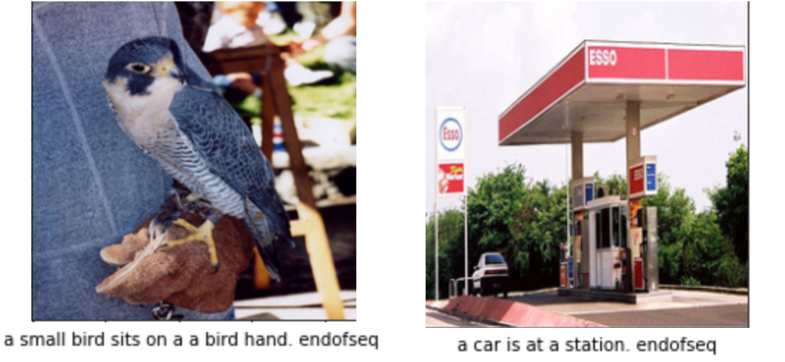
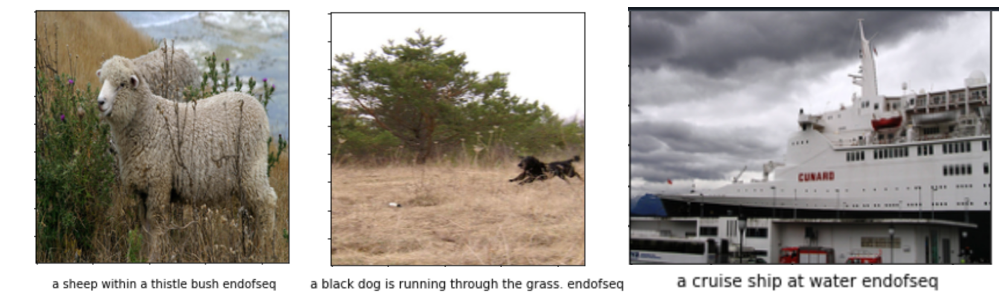

# Multilabel-Classification-and-Image-Description

In this project I have build a model for Multilabel image Classification and Image Description. Provided data was Pascal50s and abstract50S and
I needed to classify the image into given set of multilabels and also to generate a
sentence describing about the given image.

Multi-label object classification is done for the images given and it’s de-
scription given in 50 lines into 20 predefined labels. Multi-label classification involves
predicting one or more class labels. Unlike normal classification tasks where class la-
bels are mutually exclusive, multi-label classification requires specialized deep learning
algorithms that support predicting multiple mutually non-exclusive classes or “labels.”
Also in this project a model is made and trained on a given data so as to produce
textual description when fed an image data. Pretrained ImageNet and VGG16 models
as well custom made models are used to achieve the desired results.

 

Link for the demo video of above project:-
https://youtu.be/No7MK_92_Nc
